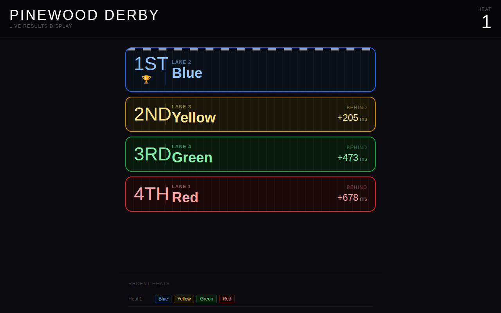
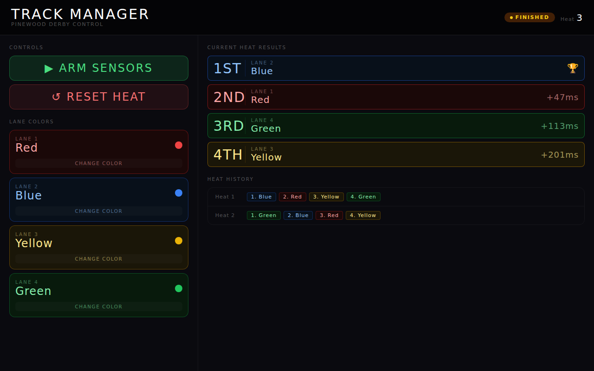

# 🏎 Pinewood Derby Race Server

A real-time race timing and display system for Pinewood Derby events. An ESP32 sensor node reads the finish-line sensors with hardware-interrupt precision, and a Node.js server manages race state and broadcasts live results to any number of connected displays over WebSocket.

---

## Features

- **Live leaderboard** — guest display auto-updates the moment each car crosses the line
- **Track manager** — arm sensors, reset heats, and configure lane colors from any browser
- **Microsecond-accurate timing** — ESP32 hardware interrupts (`esp_timer_get_time()`) record timestamps before any network call; WiFi latency has zero effect on results
- **Simulation mode** — develop and demo without any hardware
- **CSV logging** — every heat result is appended to `derby_results.csv`
- **Configurable lane count** — supports 1–4 lanes out of the box (extend `LANE_PINS` in the ESP32 sketch for more)
- **ZCam E2M4 integration** — automatically starts recording on the first lane trigger, stops when the heat finishes, downloads the clip, and plays it back on the guest dashboard

---

## Requirements

**Node.js server**

| Dependency | Version |
|---|---|
| Node.js | ≥ 18 |
| express | ^4.18 |
| ws | ^8 |
| axios | ^1 *(ZCam HTTP API)* |

**ESP32 sensor node** (Arduino libraries)

| Library | Version |
|---|---|
| ArduinoJson *(Benoit Blanchon)* | ^6.21 |

---

## Installation

```bash
git clone https://github.com/nprail/derby.git
cd derby
npm install
```

---

## Usage

```bash
# Standard run (GPIO mode, 4 lanes, port 3000)
npm start

# Simulation mode (no hardware required)
npm run simulate

# Custom options
node server.js --lanes 3 --port 8080 --timeout 10
node server.js --simulate --lanes 2

# With ZCam E2M4 video recording (replace IP with your camera's address)
node server.js --zcam 10.98.32.1
node server.js --simulate --zcam 10.98.32.1
```

### CLI Flags

| Flag | Default | Description |
|---|---|---|
| `--lanes <n>` | `4` | Number of racing lanes |
| `--port <n>` | `3000` | HTTP server port |
| `--timeout <s>` | `8` | Seconds before a heat auto-finishes if not all lanes trigger |
| `--simulate` | off | Use simulated race results instead of GPIO |
| `--zcam <ip>` | off | Enable ZCam E2M4 recording; provide the camera's IP address |

---

## Pages

| URL | Description |
|---|---|
| `http://localhost:3000/` | **Guest display** — full-screen live results, designed for a projector or TV |
| `http://localhost:3000/manage` | **Track manager** — arm/reset controls and lane color configuration |

### Guest Display (`/`)



### Track Manager (`/manage`)



---

## REST API

All endpoints return JSON.

### `GET /api/state`
Returns the current race state object.

```json
{
  "heat": 3,
  "status": "finished",
  "finishOrder": [
    { "lane": 2, "gapMs": 0 },
    { "lane": 4, "gapMs": 47.3 },
    { "lane": 1, "gapMs": 112.8 },
    { "lane": 3, "gapMs": 201.5 }
  ],
  "laneColors": { "1": "Red", "2": "Blue", "3": "Yellow", "4": "Green" },
  "numLanes": 4,
  "history": [ ... ],
  "videoUrl": "/videos/heat-3_2026-03-09_14-22-05.mov",
  "videoReplayEnabled": true,
  "zcamEnabled": true
}
```

### `POST /api/arm`
Arms the sensors and starts the heat. Returns `400` if already armed. If the previous heat finished without a reset, also increments `state.heat`.

```json
{ "ok": true }
```

### `POST /api/reset`
Clears results and returns the state to `idle`. Does **not** advance the heat number — use this to re-run the same heat. The heat number advances on the next `POST /api/arm`.

```json
{ "ok": true }
```

### `POST /api/trigger`
Called by the ESP32 sensor node when a car crosses the finish line. `timestamp_us` is the raw `esp_timer_get_time()` value from the ESP32, sent as a string to preserve 64-bit precision. The server computes `gapMs` from the difference between trigger timestamps, so WiFi latency has no effect on results. Returns `400` if the race is not armed or the lane is invalid.

```json
// Request body
{ "lane": 2, "timestamp_us": "3482910" }

// Response
{ "ok": true }
```

### `POST /api/clear-display`
Clears the video URL and broadcasts a `clear` event without advancing the heat number.

```json
{ "ok": true }
```

### `POST /api/reset-race`
Resets the entire race: clears results, sets heat back to 1, and clears history.

```json
{ "ok": true }
```

### `POST /api/colors`
Updates one or more lane colors.

```json
// Request body
{ "colors": { "1": "Purple", "3": "Orange" } }

// Response
{ "ok": true }
```

### `POST /api/settings`
Updates server settings. Persisted to `derby_config.json`.

```json
// Request body
{ "videoReplayEnabled": false }

// Response
{ "ok": true }
```

---

## WebSocket Events

Connect to `ws://localhost:3000`. Every message is a JSON object that always includes the full `state` snapshot alongside the event-specific fields.

| `type` | Extra fields | Description |
|---|---|---|
| `init` | — | Sent immediately on connection with current state |
| `armed` | — | Sensors have been armed, heat is starting |
| `trigger` | `lane`, `gapMs`, `place` | A car crossed the finish line |
| `finished` | — | All cars finished (or timeout elapsed) |
| `reset` | — | Heat state was cleared; `state.heat` is unchanged (increments on next `armed`) |
| `colors` | — | Lane colors were updated |
| `settings` | — | Settings (e.g. `videoReplayEnabled`) were updated |
| `clear` | — | Display was cleared; `state.videoUrl` is now null |
| `video` | `videoUrl` | ZCam clip has been downloaded; `state.videoUrl` is now set |

**Example client:**
```js
const ws = new WebSocket('ws://localhost:3000')
ws.onmessage = (e) => {
  const { type, state } = JSON.parse(e.data)
  console.log(type, state.finishOrder)
}
```

---

## ZCam E2M4 Integration

When the `--zcam <ip>` flag is provided, the server automatically:

1. **Starts recording** the moment the first lane trigger fires
2. **Stops recording** when the heat is complete (all lanes triggered or timeout)
3. **Downloads the clip** from the camera's SD card to `public/videos/heat-N_TIMESTAMP.ext`
4. **Broadcasts** a `video` WebSocket event so all connected dashboards update immediately (only when `videoReplayEnabled` is true)
5. **Plays the clip** automatically on the guest display below the race results

The camera must be reachable at the given IP address and in a record-ready state before each heat. The server uses the ZCam E2 HTTP API:

| ZCam endpoint | Purpose |
|---|---|
| `GET /info` | Camera availability ping |
| `GET /ctrl/session` | Acquire control session |
| `GET /ctrl/session?action=quit` | Release control session |
| `GET /datetime?date=YYYY-MM-DD&time=hh:mm:ss` | Sync camera clock to host time |
| `GET /ctrl/mode?action=query` | Query current working mode |
| `GET /ctrl/mode?action=to_rec` | Switch camera to record-ready mode |
| `GET /ctrl/rec?action=start` | Start recording |
| `GET /ctrl/rec?action=stop` | Stop recording |
| `GET /DCIM/` | List DCIM sub-folders on SD card |
| `GET /DCIM/<folder>` | List clip files in a folder |
| `GET /DCIM/<folder>/<file>` | Download a clip |

**Default ZCam IP** when connected via USB (RNDIS) or the camera's built-in Wi-Fi AP: `10.98.32.1`

```bash
node server.js --zcam 10.98.32.1
```

Downloaded clips are saved as `public/videos/heat-N_TIMESTAMP.mov` (or `.mp4`, e.g. `heat-3_2026-03-09_14-22-05.mov`) and served at `/videos/heat-N_TIMESTAMP.mov`. They are cleared from the guest display on each heat reset.

---

## Hardware Setup

The system has two components:

1. **Node.js server** — runs on any machine (laptop, Pi, etc.) on the local network. See [docs/SETUP.md](docs/SETUP.md) for installation and systemd auto-start.
2. **ESP32 sensor node** — reads the finish-line sensors and POSTs timing data to the server. See [docs/SETUP.md](docs/SETUP.md#part-2--esp32-sensor-node) for flashing instructions.

### Default ESP32 Pin Mapping

| Lane | ESP32 GPIO |
|------|------------|
| 1    | GPIO 25    |
| 2    | GPIO 26    |
| 3    | GPIO 32    |
| 4    | GPIO 33    |

To change pin assignments, edit `LANE_PINS` in [`esp32/derby_sensor/derby_sensor.ino`](esp32/derby_sensor/derby_sensor.ino).

For full wiring details and sensor circuit diagrams, see [docs/WIRING.md](docs/WIRING.md).

---

## CSV Log

Results are appended to `derby_results.csv` in the project directory after each heat.

```
date,time,heat,1st,2nd,3rd,4th,gap_2nd_ms,gap_3rd_ms,gap_4th_ms
2026-03-06,14:23:01,1,2,4,1,3,47.3,112.8,201.5
2026-03-06,14:25:44,2,3,1,2,4,18.1,95.2,340.0
```

---

## Lane Colors

Eight colors are available. Configure them per-lane from the `/manage` page.

`Red` · `Blue` · `Yellow` · `Green` · `Purple` · `Orange` · `Pink` · `White`

---

## Project Structure

```
derby/
├── server.js          # HTTP server, WebSocket, API routes, race state, CSV logging
├── gpio.js            # Race state management and simulation logic
├── zcam.js            # ZCam E2M4 HTTP API client (record, stop, download clip)
├── esp32/
│   ├── platformio.ini # PlatformIO build config
│   └── derby_sensor/
│       └── derby_sensor.ino  # ESP32 sketch: ISR timing + WiFi reporting
├── public/
│   ├── guest.html     # Guest-facing live results display (React) + heat video replay
│   ├── manage.html    # Track manager UI (React)
│   └── videos/        # Downloaded heat clips (auto-created when ZCam is enabled)
├── docs/
│   ├── SETUP.md       # Server + ESP32 setup guide
│   └── WIRING.md      # ESP32 pin mapping and sensor circuit
├── derby_results.csv  # Auto-created on first run
└── package.json
```
